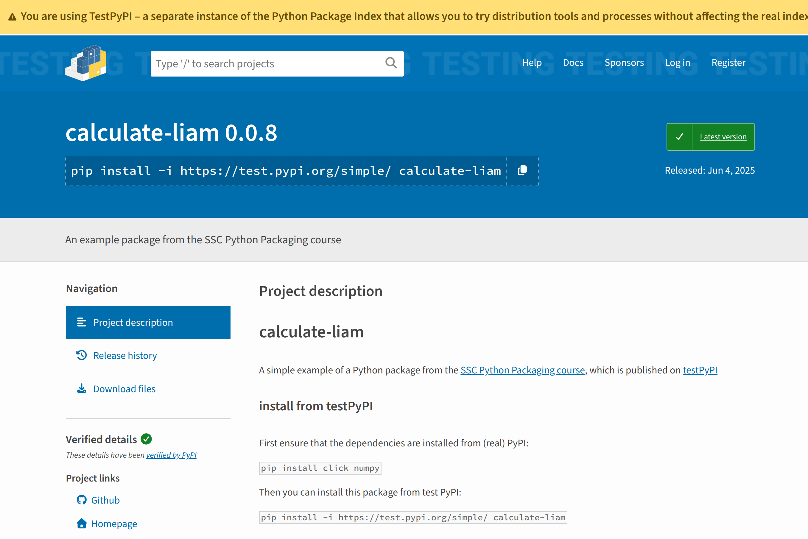

<!-- _class: title -->
<!-- _paginate: false -->
<!-- _footer: "Last updated: 2026-06-15" -->

# Python Packaging

## Liam Keegan, SSC

---

# Motivation

It would be reasonable to assume that packaging Python code should be a straightforward, well-defined, user-friendly process, much like writing Python code…

…unfortunately this is not really the case, and some googling will provide a multitude of conflicting advice on how to do this.

The Python Packaging User Guide ([packaging.python.org](https://packaging.python.org)) itself begins with this slightly discouraging note:

> *"Building your understanding of Python packaging is a journey. Patience and continuous improvement are key to success."*

Our goal today is to present a practical and modern approach to packaging and distributing your Python code.

---

# Course Outline

- Packaging overview
- Hands on: create a Python package
  - source file layout
  - pyproject.toml to allow local install using pip
- Hands on: publish to PyPI
  - add dependencies
  - add metadata
  - publish package to testPyPI
- Next steps
  - automated PyPI deployment using GitHub Actions
  - conda-forge recipe
- Compiled extension modules
  - pybind11 / nanobind c++ libraries
  - scikit-build-core for CMake integration
  - cibuildwheel to automate building of binary wheels

---

# Course slides and code

You will find the slides for this course at:

## [ssciwr.github.io/python-packaging](https://ssciwr.github.io/python-packaging)

See also the GitHub repository:

## [github.com/ssciwr/python-packaging](https://github.com/ssciwr/python-packaging)

This contains example code, as well as

- Links to example repositories
- Links to recommended resources
- Links to cookiecutters to create your own projects

It will be helpful to keep this open in a browser tab during the course.

---

<!-- _class: subtitle -->

# Packaging Overview

---

# What is a Python module?

A Python module is something that we can import in Python, typically a single Python source file (excluding the `.py` filename extension)

```python
# stats.py

import random


def flip_coin():
    return random.choice(["Heads", "Tails"])
```

```console
Python 3.14.3
>>> import stats
>>> stats.flip_coin()
'Tails'
```

If you have many modules it is often convenient to organise them in a hierarchical way, which can be done using a Python package.

---

# What is a Python package?

A Python package is simply a folder that contains Python source code files, including one with the special name `__init__.py`. When you import a package, the contents of `__init__.py` (if any) are automatically imported.

```python
# calculate/stats.py
import random
def flip_coin():
    return random.choice(["Heads", "Tails"])
```

```python
# calculate/__init__.py
from .stats import flip_coin
```

```console
Python 3.14.3
>>> import calculate
>>> calculate.flip_coin()
'Heads'
```

---

# What else is required?

---

# What else is required?

In addition to providing Python code, to make a package usable by others we typically need to provide a lot of additional information, such as:

- Do any other Python libraries need to be installed?
- Is there code that needs to be compiled?
- Which Python versions and operating systems are supported?
- Test code and how to run it
- Documentation
- License
- Authors / maintainers
- Entry points / scripts
- …

---

# How to convey this information?

How can we provide this information to the user so they can use the package? Some (not recommended) options include:

- Don't! Just let the user figure it out by trial and error
- Provide a README with instructions or a list of dependencies
- Supply a requirements.txt file with a list of dependencies for the user to install
- …

All of these are inconvenient and error-prone for the user, and it would be much nicer if we could instead provide this information to a tool which the user could use to take care of all this automatically…

---

# Where do our packages come from?

We typically install our packages from a package index / distribution / repository:

- `pip install numpy`
  - Install numpy from PyPI (Python Package Index) using pip
- `conda install numpy -c conda-forge`
  - Install numpy from the conda-forge conda channel using conda
- `brew install numpy`
  - Install numpy from homebrew using brew
- …

In all of these cases, the package manager (pip/conda/brew) performs these steps:

- First install any libraries that the package requires
- Then build any compiled modules (or install pre-built if available)
- Finally, install the Python code for the package

---

# Metadata and build recipes

So we need to tell the package manager how to build and install our package. Each package manager has a different way of doing this:

- `pip`
  - pyproject.toml file
- `conda`
  - meta.yaml recipe
- `brew`
  - formula or cask
- …

Each of these also has a different process to submit, build and publish packages.

---

# Packaging Overview

To package our Python code we need to provide two things

- The Python package itself (aka "Import package")
  - The Python source code / modules / package that the user will import
- Metadata / build / install instructions
  - What are the dependencies of our package
  - How to compile / build / install it
  - Each package manager has a different way of specifying this

Combining these allows us to publish a "Distribution package" to a repository such as such as PyPI or conda-forge, to allow users to easily install and use it.

---

<!-- _class: subtitle -->

# A Minimal Python Package

---

# A note on uv

In this course we'll use [uv](https://docs.astral.sh/uv) to manage our virtual environment and to install, build and publish our package.

To install uv see [docs.astral.sh/uv/getting-started/installation](https://docs.astral.sh/uv/getting-started/installation).

Note the use of uv is optional, everything we do could also be done using pip, build and twine:

- `uv sync` → `python -m venv .venv && source .venv/bin/activate && pip install -e .`
- `uv build` → `python -m build`
- `uv publish` → `twine upload dist/*`


---

# calculate

We'll now create a bare-bones Python package "calculate" from scratch.

For future reference, the minimal package we will create now is also available here:

[github.com/ssciwr/python-packaging/tree/main/calculate-minimal](https://github.com/ssciwr/python-packaging/tree/main/calculate-minimal)

---

<!-- _class: hands-on -->

# Recommended project structure: src layout

```text
/calculate
    /src
        /calculate
            __init__.py
            stats.py
            …
    pyproject.toml
```

- `src/calculate/` — any code that should be importable goes here, this is the Python package
- `pyproject.toml` — defines how to install the package

See [packaging.python.org/en/latest/discussions/src-layout-vs-flat-layout](https://packaging.python.org/en/latest/discussions/src-layout-vs-flat-layout) for more information.

---

<!-- _class: hands-on -->

# Python code

Our Python package consists of these two `.py` files:

```python
# src/calculate/stats.py

import random


def flip_coin():
    return random.choice(["Heads", "Tails"])
```

```python
# src/calculate/__init__.py

from .stats import flip_coin
```

---

# pyproject.toml

This is a configuration file in TOML format that contains three sections:

- `[build-system]`
  - Specify the build backend to build & install your package
  - Also any required build-time dependencies
- `[project]`
  - Specify project metadata such as name, version and authors
  - Also any required run-time dependencies
- `[tool]`
  - Settings for tools such as cibuildwheel
  - We won't need this section for now

---

# pyproject.toml: `[build-system]`

Specifies what build system should be used to build and install your package, and any packages that are required to be installed to do this.

Recommended default for pure Python packages:

```toml
[build-system]
requires = ["hatchling"]
build-backend = "hatchling.build"
```

Alternative build-systems include setuptools, flit, PDM, …

They all offer the same basic functionality, differ only in advanced features.

---

# pyproject.toml: `[project]`

Specifies project metadata and dependencies.

Minimal required contents are a project name and version number:

```toml
[project]
name = "calculate"
version = "0.0.1"
```

---

<!-- _class: hands-on -->

# pyproject.toml

A minimal complete pyproject.toml for our package:

```toml
[build-system]
requires = ["hatchling"]
build-backend = "hatchling.build"

[project]
name = "calculate"
version = "0.0.1"
```

---

<!-- _class: hands-on -->

# Bare-bones package

We now have a very minimal but installable Python package, which should look like this one:

[github.com/ssciwr/python-packaging/tree/main/calculate-minimal](https://github.com/ssciwr/python-packaging/tree/main/calculate-minimal)

From the top level directory (that contains pyproject.toml) we can now install the package using

```console
uv sync
```

This creates a virtual environment in `.venv/`, installs our package into it, and generates a `uv.lock` file recording the exact dependency versions.

Behind the scenes uv acts as a "build frontend" — it calls the "build backend" we specified in pyproject.toml to build and install the package.

---

<!-- _class: hands-on -->

# Bare-bones package

We can use `uv run` to run commands inside the project's virtual environment, e.g. to import and use our package in Python:

```console
$ uv run python
>>> import calculate
>>> calculate.flip_coin()
'Heads'
```

---

<!-- _class: hands-on -->

# Sidenote: editable install

`uv sync` installs our package as an "editable" install by default — instead of copying our source files to the install location, it installs links to them. Any changes we make to the source code are immediately reflected when we import the package, with no need to reinstall.

With pip, the equivalent is to pass `-e`:

```console
pip install -e .
```

A non-editable install (`uv pip install .` or `pip install .`) copies the source files at install time, so subsequent code changes are not picked up until the package is reinstalled.

---

<!-- _class: subtitle -->

# PyPI: Python Package Index

---

# What is PyPI?

The Python Package Index (PyPI) is a repository of Python software.

Instead of the user downloading your package files and then installing it, you can publish your package on PyPI, then the user can directly install it from there:

```console
pip install calculate
```

To publish our package to PyPI, we need to extend pyproject.toml with more metadata, then build and publish our package on PyPI.

We'll use the TestPyPI index today, but the real one works in exactly the same way.

---

# A note on package naming

***Python*** package names must consist of lower case ASCII letters, digits, and underscores "`_`", for example:

- `my_package`

***PyPI*** package names are also allowed to use hyphens "`-`" and periods "`.`" as separators, repeat separators, and are case-insensitive. So all of these are equivalent PyPI names:

- `my_package`
- `my-package`
- `My-Package`
- `my.PaCkage`
- `my._-.PacKaGe`
- …

---

# A note on package naming

It is also allowed for the ***PyPI*** package name to differ from the ***Python*** package name.

In general this is not recommended as it can lead to confusion, especially if your python package name also exists as a (different) pypi package!

Notable exception: forks of unmaintained projects that want to be a drop-in replacement for the original project, such as pillow (PIL fork):

```console
pip install pillow
```

```python
import PIL
```

---

# Recommended naming convention

Recommendation (most commonly used convention):

- Use lower case letters, digits and underscores for your package name
- Use the same name on PyPI but replace the underscores with hyphens

Example:

- Python package name: **`my_package`**
- PyPI package name: **`my-package`**

Tip: check PyPI (and conda-forge if relevant) before choosing a name for your package — many are already taken!

---

<!-- _class: hands-on -->

# Choose a name for our package

- We need a name that isn't already in use
- Suggestion: append your name, e.g. in my case
  - PyPI name: `calculate-liam`
  - Python package name: `calculate_liam`
- Check it is not taken on [test.pypi.org](https://test.pypi.org)
- Update your folder names, code and pyproject.toml accordingly
- Check that installing and importing the package still works

---

<!-- _class: hands-on -->

# Adding a dependency

Let's add some new functionality that uses numpy

```python
# stats.py

import numpy as np

def roll_dice(n_dice: int, n_sides: int):
    return np.random.randint(1, n_sides, n_dice)

def flip_coin():
    return np.random.choice(["Heads", "Tails"])
```

```python
# __init__.py

from .stats import flip_coin, roll_dice
```

---

# Dependencies in pyproject.toml

Any packages listed in dependencies will automatically be installed when your package is installed:

```toml
[project]
...
dependencies = ["numpy", "pandas", "xarray"]
...
```

You can also add more specific version/os/etc requirements here, e.g.

```toml
dependencies = [
    "numpy >= 1.16, < 2.0.0",
    "pywin32; sys_platform == 'win32'",
]
```

Much more information about this here:
[packaging.python.org/en/latest/specifications/dependency-specifiers/#dependency-specifiers](https://packaging.python.org/en/latest/specifications/dependency-specifiers/#dependency-specifiers)

---

<!-- _class: hands-on -->

# Add numpy to pyproject.toml dependencies

Let's add numpy to our project dependencies:

```toml
[project]
...
dependencies = ["numpy"]
...
```

Note that you can also do this using uv with:

```bash
uv add numpy
```

---

# Anything still missing?

```toml
/calculate-liam
    /src
        /calculate_liam    # this is the installed importable package
            __init__.py
            stats.py
            …


    pyproject.toml         # defines how to install the package


```


---

# Minimal project structure

```toml
/calculate-liam
    /src
        /calculate_liam    # this is the installed importable package
            __init__.py
            stats.py
            …
    /tests                 # tests are part of the project but not the package
        test_stats.py      # include a test file for every source file
        …
    /docs                  # docs are part of the project but not the package
        …
    pyproject.toml         # defines how to install the package
    README.md              # all projects should have a readme
    LICENSE.md             # all projects should have a license
```

---

<!-- _class: hands-on -->

# Adding a development dependency

Let's add a unit test that uses the pytest library

```python
# ../tests/test_stats.py

from calculate_liam import stats


def test_flip_coin():
    coin = stats.flip_coin()
    assert coin in ["Heads", "Tails"]
```

We don't want to make pytest a runtime dependency of our package, as users presumably won't want to run our tests. But it would be good to specify what additional dependencies are required for development.

---

<!-- _class: hands-on -->

# Dependency groups

For dependencies only needed during development (e.g. pytest), use a `[dependency-groups]` section:

```toml
[dependency-groups]
dev = ["pytest"]
```

Again, instead of editing pyproject.toml you can do this with uv:

```console
uv add --dev pytest
```

The `dev` group is synced by default — `uv run` will pick up the new dependency and run the tests:

```console
uv run pytest
```

(With pip the equivalent is: `pip install -e . --group dev`)

---

# Optional dependencies (extras)

There is a separate `[project.optional-dependencies]` section, intended for *user-facing* optional features (e.g. an optional GPU backend a user might want to enable):

```toml
[project.optional-dependencies]
plotting = ["matplotlib"]
```

The user can then opt in at install time using square brackets:

```console
uv pip install "my-package[plotting]"
```

---

<!-- _class: hands-on -->

# Adding a command line interface

Let's add a CLI using the click library, so the user can flip a coin from the command line:

```python
# cli.py

import click
from .stats import flip_coin


@click.command()
def flip_coin_cli():
    click.echo(flip_coin())
```

Don't forget to add the click library to our list of dependencies!

---

<!-- _class: hands-on -->

# Adding a script to pyproject.toml

Script entry points can be specified as "package.module:function", e.g.

```toml
[project.scripts]
flip-coin = "calculate_liam.cli:flip_coin_cli"
```

Now when our package is installed it will also install a `flip-coin` command which will call the `flip_coin_cli` function:

```console
$ uv run flip-coin
Heads
```

---

# Specify a minimum Python version

<!-- _class: hands-on -->

Requirements can be set for the allowed Python versions:

```toml
[project]
...
requires-python = ">=3.10"
...
```

You can also set a maximum allowed version here, but this is not recommended (e.g. when a newer version of Python is released your package suddenly doesn't install anymore, even though it would most likely still work with the newer Python version…)

---

# Metadata in pyproject.toml

<!-- _class: hands-on -->

Finally we add some project metadata that will be displayed by PyPI

```toml
[project]
...
authors = [
  { name="Liam Keegan", email="liam@keegan.ch" },
]
description = "A simple package to flip a coin or roll dice"
readme = "README.md"
license = "MIT"
license-files = ["LICENSE.md"]
...
```

---

# Licenses in pyproject.toml

We specified our license using the [SPDX identifier](https://spdx.org/licenses/) "MIT" and pointed to the license file:

```toml
license = "MIT"
license-files = ["LICENSE.md"]
```

This is the current recommended way to specify the license (see [PEP 639](https://peps.python.org/pep-0639)).

Here are some older (deprecated) alternatives you may see:

```toml
classifiers = [..., "License :: OSI Approved :: MIT License", ...]
```

```toml
license = { file = "LICENSE.txt" }
```

```toml
license = { text = "MIT" }
```

---

# Links in pyproject.toml

<!-- _class: hands-on -->

Project urls can also be added. You can choose any text for the labels, and PyPI will try to pick a suitable icon for the link based on your label and the url address:

```toml
[project.urls]
github = "https://github.com/ssciwr/python-packaging"
homepage = "https://ssciwr.github.io/python-packaging"
```

These appear on your project's PyPI page under "Project links".

---

<!-- _class: hands-on -->

# Complete package

We now have a more complete package which is ready to publish, consisting of these files:

- `src/calculate_liam/`
  - `__init__.py`
  - `cli.py`
  - `stats.py`
- `test/`
  - `__init__.py`
  - `test_stats.py`
- `LICENSE.md`
- `README.md`
- `pyproject.toml`

See [github.com/ssciwr/python-packaging/tree/main/calculate-liam](https://github.com/ssciwr/python-packaging/tree/main/calculate-liam) for an example.

---

<!-- _class: hands-on -->

# build

To build distributable artifacts for our package, run uv build in the directory that contains pyproject.toml:

```console
uv build
```

This generates a compressed "source distribution" and one or more "build distribution" wheel files in a directory named `dist/`.

Here uv acts as a "build frontend" — similar to when we ran `uv sync`, but instead of installing the package locally it produces redistributable artifacts.

---

# Wheel and source distributions

The `.tar.gz` file is a "source distribution" — if you decompress it you will find all the files from your project, and you can then install your package from these files (e.g. `uv pip install .` or `pip install .`).

The `.whl` file is a "built distribution" or Wheel — essentially a zip file containing only the files that need to be installed to use your package. In general these wheels can also contain pre-compiled extension modules, and in this case there may be a separate wheel for each Python version and operating system.

Both these distributions get uploaded to PyPI, and pip / uv will always prefer to install from a wheel, only falling back to the source distribution if no suitable wheel exists.

---

<!-- _class: hands-on -->

# PyPI account and API key

Make an account on testPyPI

- [https://test.pypi.org/account/register](https://test.pypi.org/account/register)

Generate an API key

- [https://test.pypi.org/manage/account/#api-tokens](https://test.pypi.org/manage/account/#api-tokens)
- Scope: Entire Account
- Copy / save the token somewhere — it won't be displayed again!

---

<!-- _class: hands-on -->

# Upload to (test)PyPI

To upload the source and built distributions that were generated in the dist folder to the testPyPI repository:

```console
uv publish --publish-url https://test.pypi.org/legacy/ --token pypi-abc123etc
```

Use the API key you generated (which should start with `pypi-`) as the token. You can also set it via the `UV_PUBLISH_TOKEN` environment variable instead of passing it on the command line.

---

# Your package on (test)PyPI



[test.pypi.org/project/calculate-liam](https://test.pypi.org/project/calculate-liam)

---

<!-- _class: hands-on -->

# Install your package from (test)PyPI

To install the package from testPyPI, specify the testPyPI url for the `index-url`, and PyPI for the `extra-index-url`:

```console
uv pip install -i https://test.pypi.org/simple --extra-index-url https://pypi.org/simple --index-strategy unsafe-best-match calculate-liam
```

The `extra-index-url` tells uv to look in the real PyPI index for any of our dependencies that are not available on testPyPI.

Or try out the CLI directly with `uvx`, without installing the package into the current environment:

```console
uvx --from calculate-liam --index https://test.pypi.org/simple --index-strategy unsafe-best-match flip-coin
```

---

# Real PyPI publishing

Publishing to the real PyPI index works in exactly the same way, the only difference is to not specify the test.pypi.org repository, and to use an API key from your real PyPI account:

```console
uv build
uv publish --token pypi-abc123etc
```

uv (and pip) use the real PyPI index by default, so installing a package that we publish on PyPI works just like installing any other package on PyPI:

```console
uv pip install calculate-liam
```

---

<!-- _class: subtitle -->

# Including resources

---

# Installing resources

At some point you may want to include other files or resources in your package, e.g. image files, data files, etc.

To have a file installed as part of our package, all we have to do is add the file to our `src` folder, and it will be automatically installed.

This applies to the hatchling build backend we are using, as well as the Flit and PDM backends.

Note that this does **not** apply to the setuptools backend!

- In this case you'll also need to specify the files to install in a MANIFEST.in file
- [setuptools.pypa.io/en/latest/userguide/miscellaneous.html#using-manifest-in](https://setuptools.pypa.io/en/latest/userguide/miscellaneous.html#using-manifest-in)

---

# Locating resources

To access your file at runtime use `importlib.resources`:

```python
from importlib import resources

resource = resources.files("calculate_liam") / "myfile.txt"
with resource.open("r") as f:
    ...
```

`resources.files()` returns a `Traversable`, not a `pathlib.Path`, but it does support `/` for joining, `.read_text()` and `.read_bytes()` and `.open()`.

If you need a filesystem path you can use `.as_file()` instead of open:

```python
with resources.as_file(resource) as path:
    ...
```
---

# Locating resources (alternative)

An alternative way is to use `__file__` to find where your package is installed

```python
from pathlib import Path

filename = Path(__file__).parent / "myfile.txt"
```

This is the simplest option, but can fail in some (unusual) edge cases:

- Your package was imported directly from a zip file, so the resource file is not actually in the expected location
- You want to locate a file that was installed as part of a *different* package, and you have done an editable install of your package

---

<!-- _class: subtitle -->

# Automated PyPI publishing

---

# GitHub actions

Instead of manually uploading the built files to PyPI, many projects use CI (continuous integration) to do this automatically, typically whenever a commit is tagged with a version number

Automatic publishing using CI in one slide:

- Actions are scripts that run automatically when code is pushed to github
- A yaml file specifies when and which actions should run
- They are mostly used for running automated tests, code linting, etc
- They can also be used for code publishing / deployment
- There is a specific action for publishing to PyPI

---

# GitHub action to publish to PyPI

```yaml
name: PyPI publishing
on: push
jobs:
  pypi:
    runs-on: ubuntu-latest
    environment: release
    permissions:
      id-token: write
    steps:
      - uses: actions/checkout@v6
      - uses: astral-sh/setup-uv@v6
      - run: uv build calculate-liam -o dist
      - run: uvx twine check dist/*
      - if: github.event_name == 'push' && startsWith(github.event.ref, 'refs/tags/')
        uses: pypa/gh-action-pypi-publish@release/v1
        with:
          repository-url: https://test.pypi.org/legacy/
          verbose: true
```

---

# PyPI trusted publishing

- Setup trusted publishing on PyPI
- Define a trusted github owner/repo/action
- Use `pypa/gh-action-pypi-publish` action
- This action can then publish to PyPI
- Avoids needing an API key

Configuration fields on the PyPI side:

- **Owner**: `ssciwr` (the GitHub organization or username)
- **Repository name**: `python-packaging`
- **Workflow name**: `pypi.yml` (must exist under `.github/workflows/`)
- **Environment name**: `release`

---

# GitHub action example

[github.com/ssciwr/python-packaging/tree/main/calculate-liam](https://github.com/ssciwr/python-packaging/tree/main/calculate-liam)

For a tagged commit, the action job builds and publishes the package to testPyPI.

---

<!-- _class: subtitle -->

# Conda-forge

---

# Conda-forge

Conda is a package manager (like pip), but not just for Python packages.

There are different channels (i.e. collections of packages) available on conda, such as

- anaconda
- conda-forge
- bioconda
- nvidia
- etc

Conda-forge is a community effort and also the most commonly used channel.

---

# Conda-forge dependencies

Pure Python dependencies work similarly on PyPI and on conda-forge, you provide a list of packages that your package depends on.

An important detail is that all these packages need to be available on conda-forge — it is not allowed to install a dependency from PyPI!

For most dependencies this is not an issue as conda-forge contains the vast majority of commonly used packages — but if you have a dependency that isn't available on conda-forge you will first need ensure that package is published on conda-forge (possibly by doing this yourself!) before you can publish your package.

---

# Conda-forge recipe 1/3

Each package has a recipe which defines all the required metadata for the package. Here is the meta.yaml recipe for our `calculate-liam` package:

```yaml



package:
  name: {{ name|lower }}
  version: {{ version }}

source:
  url: https://pypi.io/packages/source/{{ name[0] }}/{{ name }}/calculate_liam-{{ version }}.tar.gz
  sha256: ad9fe95227ecae2e8d9c1151c5efd5367f4f3c9178670a7bd85a21e1ec300656
```

---

# Conda-forge recipe 2/3

```yaml
build:
  entry_points:
    - flip-coin = calculate_liam.cli:flip_coin_cli
    - roll-dice = calculate_liam.cli:roll_dice_cli
  noarch: python
  script: {{ PYTHON }} -m pip install . -vv --no-deps --no-build-isolation
  number: 0

requirements:
  host:
    - python >=3.10
    - hatchling
    - pip
  run:
    - python >=3.10
    - click
    - numpy
```

---

# Conda-forge recipe 3/3

```yaml
test:
  imports:
    - calculate_liam
  commands:
    - pip check
    - flip-coin --help
    - roll-dice --help
  requires:
    - pip

about:
  summary: An example package from the SSC Python Packaging course
  license: MIT
  license_file: LICENSE.md

extra:
  recipe-maintainers:
    - lkeegan
```

---

# Automatically generated recipes

Most of this metadata is already in our pyproject.toml, and in fact there is a tool called `grayskull` which can automatically generate a conda-forge recipe for a package that is already published on PyPI:

```console
uvx grayskull pypi --strict-conda-forge package_name
```

For a package on testPyPI we also need to specify the testPyPI url:

```console
uvx grayskull pypi --pypi-url https://test.pypi.org/pypi calculate-liam
```

---

# Conda-forge submission workflow

To submit a new package to conda-forge:

- Fork & clone [github.com/conda-forge/staged-recipes](https://github.com/conda-forge/staged-recipes) and make a branch
  - `gh repo fork conda-forge/staged-recipes --clone`
  - `cd staged-recipes`
  - `git checkout -b calculate_liam`
- Run grayskull from the staged-recipes/recipes folder
  - `cd recipes`
  - `uvx grayskull pypi --strict-conda-forge --pypi-url https://test.pypi.org/pypi calculate-liam`
- Check/modify the generated meta.yaml (e.g. add tests)
- Check the build works locally
  - `cd .. && python build-locally.py`
- Make a Pull Request on GitHub

---

<!-- _class: subtitle -->

# Compiled extension modules

---

# Compiled extension module

We started by saying that a Python module is something you can import, typically some python source code.

The other kind of module you can import is a compiled extension module, that was written in a compiled language such as C, C++ or Fortran.

This is most commonly used for performance reasons — in most situations a compiled language can offer much better performance than an interpreted language like Python.

The other main use case is to provide a Python interface to an existing c++ library.

---

# Challenges

Compared to writing a Python module, things are more complicated:

- Need to write compiled code that interfaces with the Python C interface
- Need to integrate CMake and pyproject.toml build systems
- Then:
  - User downloads and compiles the code for their operating system and Python version
  - Typically the logic for this was added to setup.py and ran on package installation
  - But this requires the user to have a working compiler setup — many ways for this to go wrong
- Modern alternative:
  - Pre-compile the code into binary wheels for all combinations of operating systems and Python versions
  - This used to require an impractical amount of work
  - Nowadays it's actually pretty easy thanks to excellent tooling

---

# C++ bindings

There are many different ways to write a compiled extension module:

- Use C and the `Python.h` C interface
  - Low level approach, not recommended!
- Use Cython
  - Write Python-like code, ok if you don't have existing C++ code to interface with
- Use a tool like SWIG
  - Auto-generates bindings, good if you have a lot of code you want to provide bindings for
- Use a C++ library like pybind11 / nanobind / (boost.python)
  - User friendly and widely used, best choice for most situations
- We'll use pybind11 for our examples

---

# pybind11

> *"pybind11 is a lightweight header-only library that exposes C++ types in Python and vice versa, mainly to create Python bindings of existing C++ code"*

- Easy to use
- Very well documented
- Actively maintained
- Widely used
- Good performance
- See **nanobind** for a newer more efficient alternative

---

# pybind11

```cpp
// example.cpp

#include <pybind11/pybind11.h>


float square(float x) { return x * x; }


PYBIND11_MODULE(example, m) {
    m.def("square", &square);
}
```

---

# CMake

```cmake
# CMakeLists.txt

cmake_minimum_required(VERSION 3.16...4.3)
project(${SKBUILD_PROJECT_NAME} LANGUAGES CXX)

find_package(pybind11 CONFIG REQUIRED)

pybind11_add_module(example example.cpp)

install(TARGETS example LIBRARY DESTINATION .)
```

---

# Scikit-build-core

> *"Provides a bridge between CMake and the Python build system, allowing you to make Python modules with CMake."*

- Easy to use
- Excellent documentation
- Actively maintained
- Successor to widely used scikit-build
- Recently developed but already stable enough for production use

---

# Scikit-build-core

```toml
# pyproject.toml

[build-system]
requires = ["scikit-build-core", "pybind11"]
build-backend = "scikit_build_core.build"

[project]
name = "example"
version = "0.0.1"
```

---

# cibuildwheel

> *"cibuildwheel runs on your CI server — currently it supports GitHub Actions, Azure Pipelines, Travis CI, AppVeyor, CircleCI, and GitLab CI — and it builds and tests your wheels across all of your platforms."*

- Well documented
- Actively maintained
- Widely used
- Makes an impossible task trivial

---

# cibuildwheel

For each version of Python, each operating system, and each hardware architecture, cibuildwheel does the following:


The result: around 30-40 wheels (one per OS/arch/Python version), ready to upload to PyPI.

---

# cibuildwheel

```yaml
name: Build
on: [push, pull_request]
jobs:
  build_wheels:
    name: Build wheels on ${{ matrix.os }}
    runs-on: ${{ matrix.os }}
    strategy:
      matrix:
        os: [ubuntu-latest, windows-latest, macos-latest]
    steps:
      - uses: actions/checkout@v6
      - uses: pypa/cibuildwheel@v3.4
      - uses: actions/upload-artifact@v7
        with:
          name: cibw-wheels-${{ matrix.os }}-${{ strategy.job-index }}
          path: ./wheelhouse/*.whl
```

---

# Examples

[github.com/ssciwr/pybind11-numpy-example](https://github.com/ssciwr/pybind11-numpy-example)

- Simple example of use
- Uses pybind11 for bindings
- CMake and Scikit-build-core for the build system
- cibuildwheel and Github Actions to build wheels
- Publish wheels to PyPI
- Also includes an example conda-forge recipe

More complicated example: [github.com/ssciwr/hammingdist](https://github.com/ssciwr/hammingdist)

---

# Conda-forge recipe 1/2

For a package with compiled extensions, the recipe created by `grayskull` needs some modifications, in particular the build section:

```yaml
build:
  script: {{ PYTHON }} -m pip install . -vv
  number: 0
```

It's important to remove the "`noarch: python`" line if present, as this says that this package only contains Python code and doesn't need to be built separately for each architecture and Python version, which is no longer true with a compiled extension module.

---

# Conda-forge recipe 2/2

The other part that needs to be modified is the requirements section:

```yaml
requirements:
  build:
    - {{ compiler('cxx') }}
  host:
    - cmake
    - make
    - ninja
    - pip
    - pybind11
    - python
    - scikit-build-core
  run:
    - numpy
    - python
```

- In the build section we require a c++ compiler — conda will insert one for each platform, and add any required run deps (e.g. libgcc) automatically
- In the host section we require our build dependencies (e.g. pybind11), our build system (e.g. pip, scikit-build-core) and its dependencies (e.g. ninja, make, cmake)
- The run section is unchanged: our only run-time dependencies are pure Python

---

<!-- _class: subtitle -->

# Summary

---

# Summary

In this course we covered:

- Python packages
- Packaging on PyPI
- Automated PyPI deployment using GitHub Actions
- Packaging on conda-forge
- Compiled C++ extension modules

---

# SSC Cookiecutters

For your next Python project:

- Consider using our Python package cookiecutter
- [github.com/ssciwr/cookiecutter-python-package](https://github.com/ssciwr/cookiecutter-python-package)
- It includes a project structure, CI, automated pypi publishing

For your next C++ project with python bindings:

- Consider using our C++ project cookiecutter
- [github.com/ssciwr/cookiecutter-cpp-project](https://github.com/ssciwr/cookiecutter-cpp-project)
- This includes automated pypi publishing using cibuildwheel

---

# Further resources

- Pure Python packaging
  - [packaging.python.org/en/latest/tutorials/packaging-projects](https://packaging.python.org/en/latest/tutorials/packaging-projects)
  - [learn.scientific-python.org/development/guides/packaging-simple](https://learn.scientific-python.org/development/guides/packaging-simple)
- Python packaging with compiled extensions
  - [learn.scientific-python.org/development/guides/packaging-compiled](https://learn.scientific-python.org/development/guides/packaging-compiled)
  - [scikit-build-core.readthedocs.io/en/latest/getting_started.html](https://scikit-build-core.readthedocs.io/en/latest/getting_started.html)
  - [pypackaging-native.github.io](https://pypackaging-native.github.io/)
